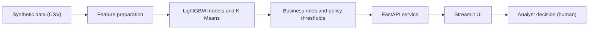

<div align="center">

# 🛡️ upay সুরক্ষা+ (Upay Surokkha+)

### Safe for Customers. Smarter for Agents.

An AI safety and intelligence layer for mobile financial services:
**scam-like transfer detection**, **agent cash-shortage forecasting** and **human-in-the-loop review**,
all explainable, all running on synthetic data.


*Built for **AI Hackathon 2026**, organized by DIU CPC × upay*

</div>

---

> **⚡ For judges: 60-second path**
> 1. **Open the live demo:** [https://upay-surokkha-4jqmcaayumvezawyeuugbf.streamlit.app/](https://upay-surokkha-4jqmcaayumvezawyeuugbf.streamlit.app/) (no install needed).
> 2. Or run it locally with the [Quick Start](#quick-start) (about five commands).
> 3. Do the [2-minute guided demo](#guided-demo-2-minutes): Customer tab → Analyst Console → Agent tab → Model & Responsible AI.
>
> *If the live app shows a "wake up" button, click it. Free hosting puts idle apps to sleep, and it needs about a minute to start.*

---

## Table of Contents

1. [Project Overview](#1-project-overview)
2. [Features](#2-features)
3. [Technology Stack](#3-technology-stack)
4. [Requirements](#4-requirements)
5. [Installation and Setup](#5-installation-and-setup)
6. [Environment Variables](#6-environment-variables)
7. [Run and Build Commands](#7-run-and-build-commands)
8. [Live Deployment URL](#8-live-deployment-url)
9. [Testing Instructions](#9-testing-instructions)
10. [Other Configuration](#10-other-configuration)
11. [Architecture and Project Structure](#11-architecture-and-project-structure)
12. [Data and Model Results](#12-data-and-model-results)
13. [Responsible AI](#13-responsible-ai)
14. [API Reference](#14-api-reference)
15. [Troubleshooting](#15-troubleshooting)
16. [Limitations and Next Steps](#16-limitations-and-next-steps)

---

## Quick Start

```bash
git clone https://github.com/Rafiqul-Islam12/Upay-Surokkha.git
cd Upay-Surokkha

python -m venv .venv
.venv\Scripts\Activate.ps1              # Windows PowerShell  (macOS/Linux: source .venv/bin/activate)
python -m pip install -r requirements.txt

python -m streamlit run app/demo.py             # starts the UI and, automatically, the backend API
```

Then open **http://localhost:8501**. (Prefer separate terminals? Run `python -m uvicorn api.main:app --port 8000` in one and the Streamlit command in another. See [Section 7](#7-run-and-build-commands).) The synthetic dataset and the trained model are already included, so there is nothing else to download or train.

> Detailed, step-by-step instructions are in [Section 5](#5-installation-and-setup) and [Section 7](#7-run-and-build-commands).

---

## 1. Project Overview

### The problem

Mobile wallets move money instantly, which is also what makes them attractive to scammers, and what makes mistakes expensive for the people and agents who depend on them.

| Who | Problem | Consequence |
|---|---|---|
| 👤 **Customers** | Scam-like transfers (a "refund" sent straight after receiving money, a large transfer to a new number at 3 AM, a burst of rapid transfers) look normal until the money is gone. | Irreversible loss and lower trust in digital wallets. |
| 🏪 **Agents** | Cash runs out on peak days (salary week, Thursdays) with no early warning. | Customers are turned away; service availability suffers. |
| 🔍 **Operations** | Suspicious cases need consistent, explainable human review. | Analyst time is wasted on cases with no context. |

**Problem statement (hackathon format):** *For upay wallet customers, sending money to scam-like recipients causes irreversible loss and eroded trust. We built **ScamShield**, which uses transaction behaviour features to score each transfer, explain why, and route high-risk cases to a human analyst, with success measured by recall, precision and false-alarm rate on a held-out test split. For agents, running out of cash on peak days turns customers away. We built **Agent Copilot**, which forecasts 7-day cash-out demand to warn the agent early, measured against a simple 7-day-average baseline.*

### The proposed solution

**upay সুরক্ষা+** is one platform with three AI modules and one human-review console:

- 🛡️ **ScamShield** scores every transfer, shows the top reasons (SHAP) and recommends a safer next step.
- 🏪 **Agent Copilot** forecasts the next 7 days of cash-out demand per agent and warns before cash runs short.
- 💰 **Cost Advisor** *(supporting feature)* groups customers by cash-out behaviour and suggests where small cash-outs could be digital payments.
- 🔍 **Analyst Console** lets a person confirm safe or hold a flagged case. **Nothing is ever blocked automatically.**

### Purpose

A working, end-to-end prototype for **AI Hackathon 2026 (DIU CPC × upay)**, designed around the program's principles: customer-first, AI with purpose, privacy by design (synthetic data only) and responsible innovation.

| Hackathon track | Where it appears |
|---|---|
| 01 · Trust & Risk Intelligence | ScamShield, SHAP explanations, Analyst Console |
| 05 · Merchant & Agent Intelligence | Agent Copilot (liquidity forecasting) |
| 02 · Customer Intelligence | Cost Advisor (behavioural segmentation), supporting feature |

---

## 2. Features

### Implemented features at a glance

| # | Feature | What it does | AI component |
|---|---|---|---|
| 1 | 🛡️ **ScamShield** | Scores a transfer from 0 to 1, assigns LOW / MEDIUM / HIGH, explains the reasons, recommends an action, and shows a Bangla message. | LightGBM classifier + SHAP |
| 2 | 🏪 **Agent Copilot** | Forecasts each agent's cash-out demand for the next 7 days, compares it with estimated cash on hand, and recommends a top-up amount. | LightGBM regressor |
| 3 | 💰 **Cost Advisor** | Segments customers by cash-out behaviour and estimates possible monthly fee savings (assumption-based). | K-Means clustering |
| 4 | 🔍 **Analyst Console** | Queue of flagged cases with reasons and SHAP chart. The analyst confirms safe or holds for review. | Human-in-the-loop on top of model output |
| 5 | 📊 **Overview and Model tabs** | Data charts, live model metrics, forecast accuracy and the Responsible AI principles. | Reporting layer |
| 6 | ⚖️ **Fairness check** *(offline script)* | Measures ScamShield's recall and false-alarm rate by gender, area and age group on the held-out test split and saves the result to `models/fairness.json`. | Model evaluation (no extra model) |

### How the AI components are used

<details open>
<summary><b>🛡️ ScamShield (fraud and scam-like transfer scoring)</b></summary>

- **Model:** `LGBMClassifier` (300 trees, early stopping on a validation split, class imbalance handled with `scale_pos_weight`).
- **Seven features per transfer:** `amount`, `amount_ratio` (amount divided by the customer's usual amount), `hour`, `is_night`, `is_new_recipient`, `tx_last_10min`, `just_received_money`. No demographic features are used.
- **Explainability:** a SHAP `TreeExplainer` returns each feature's contribution to the score. The five largest drivers are shown as bars, and the top risk-increasing ones become plain-language reasons.
- **Policy layer (separate from the model):** `src/rules.py` turns the score into an action. Score below 0.15 is **LOW** (proceed), 0.15 to 0.30 is **MEDIUM** (warn the customer), and 0.30 or above is **HIGH** (additional verification and analyst review).
- **Bilingual output:** every result includes an English recommendation and a Bangla message. Both come from templates, **no LLM is involved**, so decisions are deterministic and cannot be prompt-injected.

</details>

<details>
<summary><b>🏪 Agent Copilot (liquidity forecasting)</b></summary>

- **Model:** `LGBMRegressor` trained on daily cash-out volume per agent (50 agents).
- **Features:** day of week, day of month, month-start flag, yesterday's demand, demand 7 days ago, 7-day mean, and the agent's float capacity.
- **Forecast:** recursive, 7 days ahead. Accuracy is measured on the **last 14 days held out from training** and compared with a simple 7-day-average baseline.
- **Business rule:** a **MEDIUM** warning when forecast demand reaches 80% of estimated cash, and **HIGH** at 100%, with the suggested top-up amount in the message.
- **Assumption:** the dataset has no real cash balances, so cash on hand is assumed to be 25% of float capacity. The UI states this next to every result.

</details>

<details>
<summary><b>💰 Cost Advisor (behavioural segmentation)</b></summary>

- **Model:** K-Means (3 clusters) on monthly cash-out count, average cash-out amount and share of small cash-outs, shown as *Low*, *Regular* and *Frequent* cash-out segments.
- **Savings estimate:** the monthly value of shifting 40% of cash-outs under ৳1,500 to merchant payments, at an **assumed** 1.4% fee. This is a prototype assumption, not the official upay fee schedule, and the UI says so.

</details>

<details>
<summary><b>🔍 Analyst Console (human oversight)</b></summary>

- MEDIUM and HIGH results create cases. HIGH cases wait as **Pending review**; MEDIUM cases are recorded as **Customer warned**.
- The analyst opens a case, sees the reasons and SHAP drivers, and chooses **Confirm Safe** or **Hold / Escalate**.
- Holding is a temporary step for review, never a permanent block and never a judgement about the person.

</details>

---

## 3. Technology Stack

| Layer | Technology |
|---|---|
| **Language** | Python 3.11+ |
| **Backend API** | FastAPI, Uvicorn, Pydantic |
| **Frontend** | Streamlit with custom CSS, Altair charts, Plus Jakarta Sans and Hind Siliguri fonts |
| **ML models** | LightGBM (classifier and regressor), scikit-learn (K-Means, scaling, metrics) |
| **Explainability** | SHAP (`TreeExplainer`) |
| **Data** | pandas, NumPy, Faker, synthetic data generator in `src/generate_data.py` |
| **Model storage** | joblib (`models/scam_model.pkl`) |
| **HTTP client** | requests (UI to API) |
| **External AI APIs / LLMs** | **None.** No API keys and no paid services are needed |
| **External services** | Google Fonts (loaded by the UI; falls back to system fonts when offline) |

<details>
<summary><b>Package versions this project was verified with</b></summary>

`requirements.txt` is intentionally unpinned. The full flow (install, API, UI, every endpoint, retraining, data regeneration) was verified on **Python 3.12** with:

| Package | Version | Package | Version |
|---|---|---|---|
| fastapi | 0.142.2 | lightgbm | 4.7.0 |
| uvicorn | 0.54.0 | scikit-learn | 1.9.1 |
| pydantic | 2.13.5 | shap | 0.52.0 |
| streamlit | 1.65.0 | pandas | 3.0.6 |
| altair | 6.3.0 | numpy | 2.5.3 |
| requests | 2.34.2 | joblib / Faker | 1.6.0 / 40.40.0 |

</details>

---

## 4. Requirements

| Item | Requirement |
|---|---|
| **Operating system** | Windows, macOS or Linux |
| **Python** | 3.11 or newer, with `pip` and `venv` |
| **Git** | To clone the repository |
| **Hardware** | Any modern laptop or desktop, **CPU only** (no GPU). The API uses roughly 0.5 GB of RAM; 4 GB of RAM is comfortable. About 1.5 GB of free disk space covers the virtual environment and the 30 MB dataset |
| **Internet** | Needed once to install packages (and for the UI's web fonts). The app itself runs fully offline afterwards |
| **Free ports** | `8000` (API) and `8501` (UI) |
| **Browser** | Any modern browser |
| **Accounts / keys** | None |

All Python dependencies are listed in [`requirements.txt`](requirements.txt): `fastapi`, `uvicorn`, `streamlit`, `requests`, `pandas`, `numpy`, `scikit-learn`, `lightgbm`, `shap`, `joblib`, `faker`.

---

## 5. Installation and Setup

**Step 1. Get the code**

```bash
git clone https://github.com/Rafiqul-Islam12/Upay-Surokkha.git
cd Upay-Surokkha
```

**Step 2. Create a virtual environment**

```bash
python -m venv .venv
```
> On Windows, if `python` is not recognised, use `py -m venv .venv`.

**Step 3. Activate it**

```powershell
# Windows PowerShell
.venv\Scripts\Activate.ps1

# Windows Command Prompt
.venv\Scripts\activate.bat

# macOS / Linux
source .venv/bin/activate
```
Your prompt should now start with `(.venv)`.

<details>
<summary>PowerShell says "running scripts is disabled"?</summary>

Run this once, then activate again:
```powershell
Set-ExecutionPolicy -Scope CurrentUser -ExecutionPolicy RemoteSigned
```
</details>

**Step 4. Install dependencies**

```bash
python -m pip install -r requirements.txt
```

**Step 5. Check the included files** (nothing to configure)

The repository already ships with everything needed to run:

| File | Purpose |
|---|---|
| `data/customers.csv`, `data/agents.csv`, `data/transactions.csv` | Synthetic dataset (10,000 customers, 50 agents, 421,677 transactions) |
| `models/scam_model.pkl` | Trained ScamShield model |
| `models/metrics.json` | Saved test metrics shown in the UI |

No `.env` file, database, API key or login is required. To rebuild the data and model yourself, see [Rebuilding data and model](#rebuilding-data-and-model-optional).

---

## 6. Environment Variables

The project has **no secrets**. There is a single, optional variable:

| Variable | Required | Default | Purpose |
|---|---|---|---|
| `UPAY_API` | No | `http://127.0.0.1:8000` | Base URL of the FastAPI backend that the Streamlit UI calls. **Leave it unset** for normal use: if no backend answers on `127.0.0.1:8000`, the UI starts one itself. Set it only to point the UI at a backend running elsewhere (another port or a separately deployed API). |

Set it **in the terminal where you start the UI**, before `streamlit run`:

```powershell
# Windows PowerShell
$env:UPAY_API = "http://127.0.0.1:8000"

# Windows Command Prompt
set UPAY_API=http://127.0.0.1:8000

# macOS / Linux
export UPAY_API=http://127.0.0.1:8000
```

> There is no `.env` file to create. If a future version adds keys, they must be kept as placeholders in the repository and never committed.

---

## 7. Run and Build Commands

The app has two parts, the FastAPI backend and the Streamlit UI. There are two ways to run it. Always work from the repository root with the virtual environment activated.

**Option A: one command.** The UI starts the backend automatically if it is not running yet (this is how the live deployment works):

```bash
python -m streamlit run app/demo.py
```
The first load shows *"Starting backend..."* for a short while.

**Option B: two terminals.** Useful for developing the API or opening its `/docs` page:

#### Terminal 1: backend API

```bash
python -m uvicorn api.main:app --port 8000
```
Wait for `Application startup complete`. On our machine this takes a few seconds; on slower machines the first start can take longer because the API loads the model and pre-computes agent forecasts and customer segments.

- Interactive API docs: **http://127.0.0.1:8000/docs**
- Health check: **http://127.0.0.1:8000/health**

> Opening `http://127.0.0.1:8000/` directly shows `{"detail":"Not Found"}`. That is expected, the API has no home page. Use `/docs`.

#### Terminal 2: user interface

```bash
python -m streamlit run app/demo.py
```
The UI opens at **http://localhost:8501**. If Streamlit asks for an email on the first run, press **Enter** to skip.

### Build instructions

There is **no build or compile step**. The app runs directly from source.

### Rebuilding data and model (optional)

Everything is deterministic (fixed random seed 42), so rebuilding reproduces the shipped files. Run from the repository root:

```bash
python src/generate_data.py     # regenerate the synthetic dataset (about half a minute)
python src/train_model.py       # retrain ScamShield, rewrite models/scam_model.pkl and models/metrics.json (a few seconds)
python src/fairness_check.py    # group-wise fairness report, prints a summary and writes models/fairness.json (about 20 seconds)
```
Restart the API afterwards so it loads the new files. Run `fairness_check.py` from the **repository root**, after `train_model.py` has produced the model. The agent forecast model and the customer segments are rebuilt automatically every time the API starts.

---

## 8. Live Deployment URL

| | |
|---|---|
| 🌐 **Live app** | **[https://upay-surokkha-4jqmcaayumvezawyeuugbf.streamlit.app/](https://upay-surokkha-4jqmcaayumvezawyeuugbf.streamlit.app/)** |

**How it is hosted:** the app is deployed on **Streamlit Community Cloud** (free tier) directly from this repository (`main` branch, entry file `app/demo.py`). The FastAPI backend is not a separate public service. When no `UPAY_API` variable is set, the UI starts the backend as a child process inside the same container and talks to it on `127.0.0.1:8000`. For that reason the API's interactive docs (`/docs`) are available only when you run the project locally.

**Good to know:**
- Free hosting puts the app to sleep after a period without visitors (Streamlit documents 12 hours). If you see a wake-up button, click it and wait about a minute.
- The first load also starts the backend (loading the model and pre-computing forecasts), so it can take longer than later visits.
- The analyst case list is kept in memory and resets when the app restarts.

If the live link is unavailable, the project runs locally in a few minutes with the [Quick Start](#quick-start).

---

## 9. Testing Instructions

The project does not include an automated unit-test suite yet. It is verified through the checks below. Every API check was run and confirmed on a clean install, and the UI was confirmed to render all five tabs without errors.

### Guided demo (2 minutes)

Open the [live app](#8-live-deployment-url) (or start it locally with `python -m streamlit run app/demo.py`) and follow the tabs from left to right:

1. **👤 Customer · ScamShield:** choose *"Scam-like: new recipient + big amount at 3 AM"* and press **Analyze transaction**. You should see a HIGH risk gauge, the reasons, a SHAP bar chart and a Bangla message.
2. **🔍 Analyst Console:** open the new case and press **Confirm Safe** or **Hold / Escalate**. The status updates.
3. **🏪 Agent · Copilot:** pick an agent. You get a 7-day forecast chart, a cash coverage meter and a recommendation.
4. **📊 Model & Responsible AI:** review the held-out metrics and the Responsible AI principles.

### Check 1: ScamShield scenarios (Customer tab)

Each scenario is one entry in the **Demo scenario** drop-down. Scores are approximate.

| Scenario | Expected level | Score | Needs human review | Strongest reason (SHAP) |
|---|---|---|---|---|
| Normal transaction | 🟢 LOW | ≈ 0.02 | No | None significant |
| Unusual (new recipient, 4× amount) | 🟠 MEDIUM | ≈ 0.21 | No (customer warned) | Amount vs usual |
| New recipient + big amount at 3 AM | 🔴 HIGH | ≈ 0.34 | **Yes** | Hour of day |
| "Refund" right after receiving money | 🔴 HIGH | ≈ 0.34 | **Yes** | Just received money |
| 4 rapid transfers in 10 minutes | 🔴 HIGH | ≈ 0.35 | **Yes** | Transactions in last 10 min |

### Check 2: Call the API directly

With the API running, score a transaction:

```bash
# macOS / Linux / Git Bash
curl -s -X POST http://127.0.0.1:8000/score \
  -H "Content-Type: application/json" \
  -d '{"amount":8000,"amount_ratio":9.0,"hour":3,"is_new_recipient":1,"tx_last_10min":1,"just_received_money":0,"recipient":"01911-XXXXXX"}'
```

```powershell
# Windows PowerShell
$body = @{ amount=8000; amount_ratio=9.0; hour=3; is_new_recipient=1; tx_last_10min=1; just_received_money=0; recipient="01911-XXXXXX" } | ConvertTo-Json
Invoke-RestMethod -Uri http://127.0.0.1:8000/score -Method Post -Body $body -ContentType "application/json" | ConvertTo-Json -Depth 5
```

**Expected:** `"risk_level": "HIGH"`, a score of about `0.335`, `"needs_human_review": true`, reasons, and a `drivers` list with SHAP values.

You can also try every endpoint from **http://127.0.0.1:8000/docs** (**Try it out** button).

### Check 3: Other endpoints

| Request | What to expect |
|---|---|
| `GET /health` | `{"status":"ok"}` |
| `GET /metrics` | ScamShield test metrics and agent forecast accuracy (`mae_model` ≈ 10,662 vs `mae_baseline` ≈ 12,256, about 13% better) |
| `GET /demo_agents` | Six agent IDs with the highest forecast pressure |
| `GET /agent/{id}/float` | With an ID from the line above, a 7-day forecast, risk level and a Bangla message (the top agent is HIGH risk) |
| `GET /demo_customers` | Five customer IDs |
| `GET /customer/{id}/savings` | With an ID from the line above, a segment, monthly cash-out count and estimated saving |
| `GET /cases` | Cases created so far (empty after a restart) |
| `POST /cases/{id}/allow` and `/escalate` | Case status becomes `confirmed_safe` or `held_for_review` |
| `POST /cases/{id}/anything-else` | `400` (invalid decision) |
| `POST /cases/99/allow` | `404` (case not found) |
| `GET /agent/ZZZ/float` or `/customer/ZZZ/savings` | `{"found": false}` |

### Check 4: Reproduce the reported metrics

```bash
python src/train_model.py
```
It prints the test metrics, per-pattern recall and SHAP feature importance, and rewrites `models/metrics.json`. The numbers match the table in [Section 12](#12-data-and-model-results) because the split and seeds are fixed (tiny differences are possible with other library versions).

### Check 5: Fairness report

```bash
python src/fairness_check.py
```
It prints recall and false-alarm rate for each group and writes `models/fairness.json`. Expected: all groups close to the overall figures (see [Section 12](#fairness-check-held-out-test-split)).

---

## 10. Other Configuration

| Item | Details |
|---|---|
| **Streamlit settings** | `.streamlit/config.toml` sets the light theme and brand colours, runs in headless mode and turns off usage statistics. No change needed. |
| **Run location** | Start the API from the **repository root** so `api.main` can be imported. Data and model paths are resolved from the file locations, with one exception: `src/fairness_check.py` also expects to be run from the repository root. |
| **Data files** | `data/*.csv` (about 30 MB) and `models/scam_model.pkl` must be present at runtime. They are committed to the repository. `models/fairness.json` is an output of `src/fairness_check.py`; the app does not need it to run. |
| **Policy thresholds** | `LOW = 0.15` and `HIGH = 0.30` in `src/rules.py`. Agent warning levels (`WARN = 0.8`, `DANGER = 1.0`) and `CASH_SHARE = 0.25` are in `src/agent_float.py`. Fee and shift assumptions (`FEE_RATE`, `SMALL_LIMIT`, `SHIFT_SHARE`) are in `src/cashout_saver.py`. |
| **State** | There is no database. The analyst case list lives in the API's memory and resets when the API restarts. |
| **Network** | The UI talks to the API over plain HTTP. The API has no authentication, so keep it on localhost, or behind your own access control, when deploying. |
| **Access requirements** | None. No login, no keys, no real upay data. |

---

## 11. Architecture and Project Structure



**Design principles** (from the hackathon guideline):

- **Prediction is separate from recommendation:** the model outputs a score, and `src/rules.py` turns it into an action.
- **Data preparation and training are separate from serving:** `src/generate_data.py` and `src/train_model.py` build the data and the model offline, and `api/main.py` serves them.
- **No decision logic in an LLM prompt:** there is no LLM.

```text
.
├── api/
│   └── main.py              # FastAPI service: scoring, cases, agents, savings, metrics
├── app/
│   └── demo.py              # Streamlit UI (5 tabs, Bangla + English)
├── src/
│   ├── generate_data.py     # Synthetic data generator (seed 42)
│   ├── train_model.py       # ScamShield features, training, evaluation, SHAP
│   ├── fairness_check.py    # Group-wise fairness report (gender, area, age group)
│   ├── rules.py             # Business rules: thresholds, reasons, bilingual messages
│   ├── agent_float.py       # Agent liquidity forecasting
│   └── cashout_saver.py     # Cost Advisor (K-Means segments + savings estimate)
├── data/                    # Synthetic customers, agents, transactions (CSV)
├── models/                  # scam_model.pkl, metrics.json, fairness.json (generated by fairness_check.py)
├── .streamlit/config.toml   # UI theme and server settings
├── requirements.txt
└── README.md
```

---

## 12. Data and Model Results

### Synthetic dataset

No real upay or customer data is used anywhere. Everything is generated by `src/generate_data.py` with a fixed seed, so regenerating gives the same dataset.

| Item | Value |
|---|---|
| Customers / agents | 10,000 / 50 |
| Period | 90 days starting 2026-07-01 |
| Transactions | 421,677 (send, cash-out, merchant, bill pay) |
| Scam-like share | 2.9% by construction |
| Scam-like patterns | Rapid transfers (5,702), new recipient with large amount (2,414), late-night transfer (2,075), "refund" after receiving money (2,034) |
| Realism built in | Legitimate edge cases (valid night transactions, valid large amounts, valid new recipients), weekday and salary-week cash-out effects |
| Split | **Chronological**: 70% train (295,173), 15% validation (63,252), 15% **test (63,252)**. The test set is never used for training or threshold selection. |

### ScamShield results (held-out test split)

| Metric | Value |
|---|---|
| ROC-AUC | **0.981** |
| Recall (scam-like caught) | **85.9%** |
| Precision | 56.6% |
| F1 | 0.682 |
| False alarm rate | 1.95% of normal transactions |
| Decision threshold | 0.30 (chosen on validation data; equals the HIGH policy threshold) |
| Test set | 63,252 transactions, 1,812 scam-like |

**Recall by pattern:** "refund" 100%, late-night 99.6%, new recipient with large amount 79.0%, rapid transfers 79.0%.
**Most influential features (mean absolute SHAP):** `amount_ratio` 0.495, `is_new_recipient` 0.309, `hour` 0.136, `tx_last_10min` 0.034, `just_received_money` 0.029.

### Fairness check (held-out test split)

`src/fairness_check.py` applies the same 0.30 decision threshold to the test split and compares groups. The model itself uses **no demographic feature**; this checks that it still behaves similarly across groups.

| Group | Test transactions | Recall | False alarm rate |
|---|---|---|---|
| Gender: Female | 28,765 | 85.7% | 1.76% |
| Gender: Male | 34,168 | 86.1% | 1.95% |
| Area: Rural | 35,315 | 86.1% | 1.99% |
| Area: Urban | 27,618 | 85.7% | 1.69% |
| Age 18-30 | 15,890 | 85.0% | 2.11% |
| Age 31-45 | 18,736 | 85.8% | 1.72% |
| Age 46-69 | 28,307 | 86.6% | 1.81% |

**Reading the table:** recall stays within 85.0% to 86.6% and the false-alarm rate within 1.69% to 2.11% across all groups (the highest is about 1.25× the lowest). The 319 test rows excluded from this table are the incoming legs of simulated "refund" scams, whose sender IDs are outside the customer table and so have no demographic attributes (none of them is labelled scam-like).

> ⚠️ **Honest note:** in the synthetic generator, victims are picked at random and scam rates are almost equal across groups (about 2.9% to 3.0%). Small gaps are therefore expected by construction. This check shows the evaluation is in place and working, **not** that the model is fair on real customers. It must be repeated on real, governed data.

### Agent Copilot results (last 14 days held out)

| Model | Mean absolute error per agent-day |
|---|---|
| 7-day-average baseline | ৳12,256 |
| **LightGBM forecast** | **৳10,662** (about **13% lower**) |

> ⚠️ **Honest note:** the scam patterns are injected into synthetic data, so these numbers show that the pipeline works end to end, **not** how it would perform on real traffic. Validation on real, governed data is the planned next step.

---

## 13. Responsible AI

| Principle | How it is built in |
|---|---|
| 🔎 **Explainability** | Every score comes with SHAP feature contributions and plain-language reasons. |
| 🧑‍⚖️ **Human oversight** | HIGH-risk cases go to an analyst who confirms safe or holds for review. |
| 🚫 **No autonomous consequences** | No account or transaction is blocked automatically or permanently. |
| 🧭 **Prediction ≠ recommendation** | The model gives a score. The action comes from a separate, visible policy layer. |
| 🤲 **Respectful wording** | Messages call a *transaction* high-risk, never a *person* fraudulent. |
| 🔐 **Privacy by design** | Synthetic data only. The model uses no demographic or personal attributes. |
| ⚙️ **Works without an LLM** | All decisions come from the ML model and simple rules, so there is no prompt-injection surface. |
| ⚖️ **Fairness** | No demographic features in the model. `src/fairness_check.py` compares recall and false-alarm rate by gender, area and age group (offline script, results in Section 12). |
| 📝 **Transparent assumptions** | Assumption-based numbers (fee rate, cash share) are labelled as assumptions in the UI. |

---

## 14. API Reference

Interactive documentation is generated automatically at `/docs` (Swagger UI) and `/redoc`.

| Method | Endpoint | Description |
|---|---|---|
| `GET` | `/health` | Service health check |
| `POST` | `/score` | Score a transaction, return risk level, reasons, SHAP drivers and messages. Creates a case for MEDIUM and HIGH |
| `GET` | `/cases` | List analyst cases |
| `POST` | `/cases/{id}/allow` | Analyst confirms the case as safe |
| `POST` | `/cases/{id}/escalate` | Analyst holds the case for review |
| `GET` | `/metrics` | ScamShield test metrics and agent forecast accuracy |
| `GET` | `/demo_agents` | Agents with the highest forecast pressure |
| `GET` | `/agent/{id}/float` | 7-day cash-out forecast, risk level and recommendation |
| `GET` | `/demo_customers` | Example customers for Cost Advisor |
| `GET` | `/customer/{id}/savings` | Segment and assumption-based saving estimate |

<details>
<summary><b>Request body for <code>POST /score</code></b></summary>

| Field | Type | Required | Meaning |
|---|---|---|---|
| `amount` | number | yes | Transaction amount in BDT |
| `amount_ratio` | number | yes | Amount divided by the customer's usual amount |
| `hour` | integer | yes | Hour of day, 0 to 23 |
| `is_new_recipient` | 0 or 1 | yes | First time sending to this recipient |
| `tx_last_10min` | integer | no (default 1) | Transactions by this customer in the last 10 minutes |
| `just_received_money` | 0 or 1 | no (default 0) | Customer received money in the last 15 minutes |
| `recipient` | string | no | Display only (demo number). Not used by the model |

Key response fields: `risk_level`, `score`, `needs_human_review`, `reasons`, `reasons_bn`, `drivers` (SHAP), `recommended_action`, `recommended_action_bn`, `message_bn`, `thresholds`.

</details>

---

## 15. Troubleshooting

| Symptom | Fix |
|---|---|
| `uvicorn` or `streamlit` "is not recognized" | Use the module form: `python -m uvicorn ...` and `python -m streamlit ...` |
| `ModuleNotFoundError` | The virtual environment is not active, or dependencies are missing. Activate it and run `python -m pip install -r requirements.txt` |
| Cannot activate the venv in PowerShell | `Set-ExecutionPolicy -Scope CurrentUser -ExecutionPolicy RemoteSigned`, then activate again |
| UI shows *"Could not reach the backend"* | Wait for *"Starting backend..."* to finish and refresh. If it persists, start the API manually (`python -m uvicorn api.main:app --port 8000`) and check that `UPAY_API`, if set, matches its address |
| Code changes in `api/` or `src/` have no effect | An older backend is still running on port 8000. Stop it (or use another port) and restart |
| `http://127.0.0.1:8000` shows *Not Found* | Expected. Use `/docs` |
| Port already in use | Pick another port, for example `--port 8001`, then set `UPAY_API=http://127.0.0.1:8001` before starting the UI |
| Analyst Console is empty | Analyze a transaction in the Customer tab, or click **Load demo alerts** |
| Streamlit asks for an email | Press **Enter** to skip |
| First API start feels slow | It trains the agent forecast model at start-up. Wait for `Application startup complete` |

---

## 16. Limitations and Next Steps

**Current limitations (stated openly):**

- All data is synthetic and scam patterns are injected by design, so metrics do not predict real-world performance.
- Demo scenarios supply features such as `amount_ratio` directly. A production system would compute them from each customer's real history.
- The cash-on-hand and fee figures are labelled assumptions, not upay data.
- The case queue is in memory and the API has no authentication (prototype scope).
- The fairness check runs on synthetic data where scam rates are almost equal across groups by design, and it is an offline script (it is not shown in the UI). It must be repeated on real data.
- Automated tests are not included yet (see [Section 9](#9-testing-instructions) for the verification checks).

**Path toward real use** (following the hackathon's post-hackathon pathway):

1. Technical and business review of the prototype.
2. Controlled validation on appropriately governed, anonymised or aggregated data.
3. Compute behavioural features from real history, add a persistent case store with an audit trail, and add authentication.
4. Repeat the fairness evaluation on real data and add drift monitoring, then a proof of concept in a real operational context.

---

<div align="center">

**upay সুরক্ষা+** · Safe for Customers. Smarter for Agents.
Prototype built on synthetic data · AI Hackathon 2026 · DIU CPC × upay

</div>
